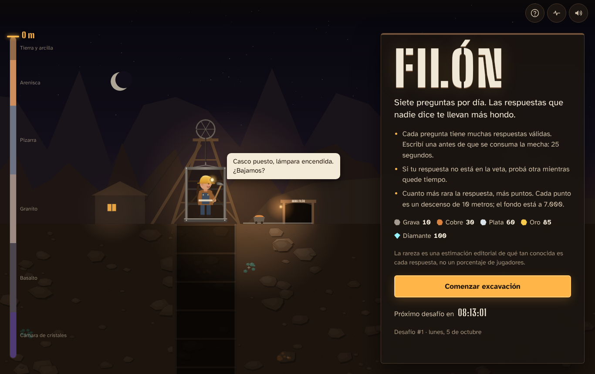
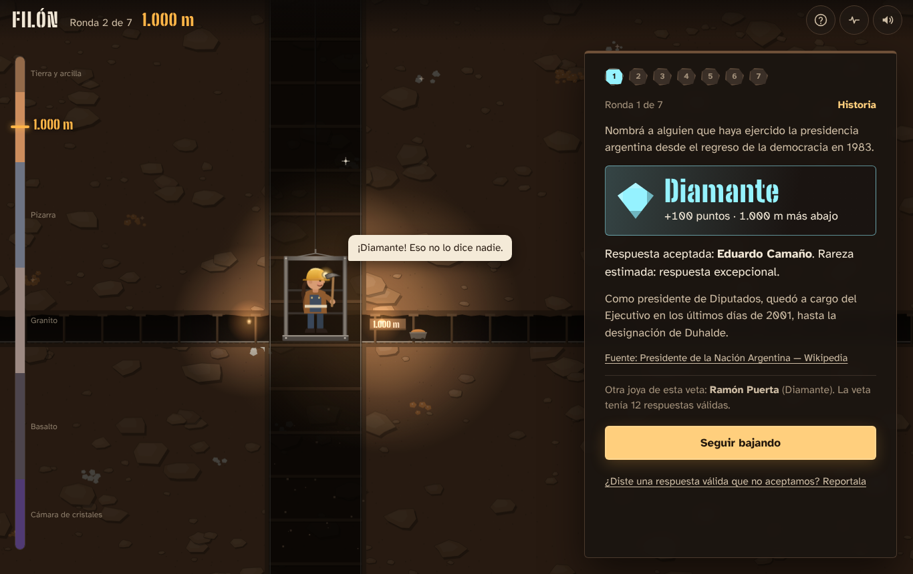
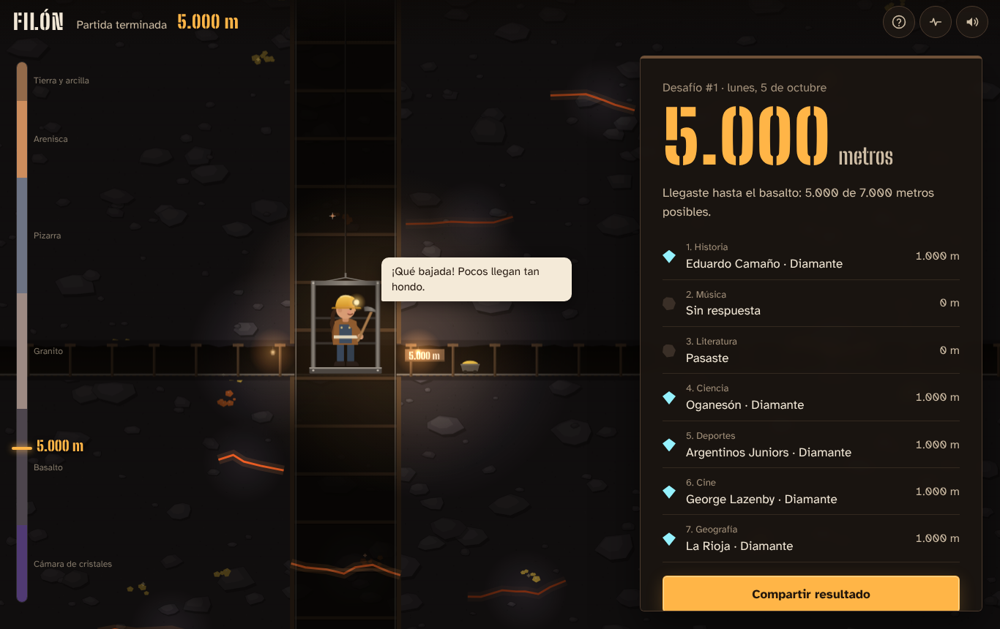
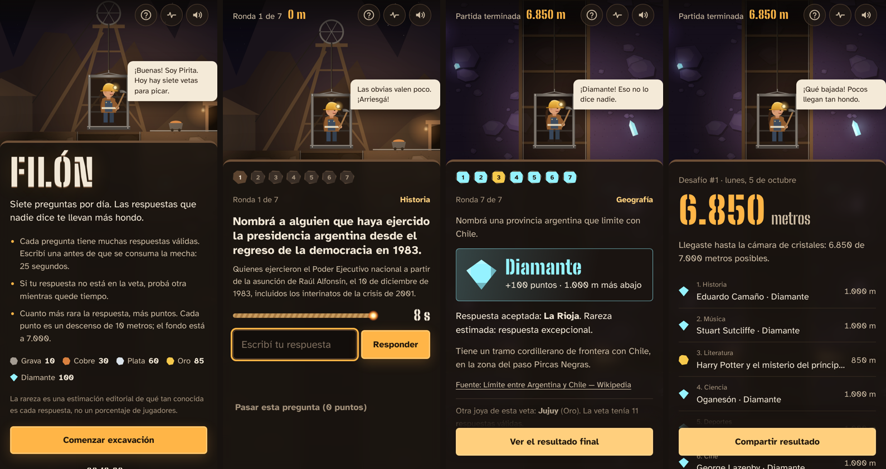

# Filón

Juego web diario de cultura general ambientado en un viaje por las capas de la Tierra. Cada día hay siete preguntas, iguales para todos. Cada una admite muchas respuestas correctas y el jugador escribe una sola: cuanto menos obvia es la respuesta, más puntos vale y más hondo cava Lito, el gusano explorador. Cada punto son 10 metros; el fondo está a 7.000.

| Rareza estimada | Puntos | Descenso |
| --- | --- | --- |
| Grava — muy conocida | 10 | 100 m |
| Cobre — común | 30 | 300 m |
| Plata — menos evidente | 60 | 600 m |
| Oro — poco conocida | 85 | 850 m |
| Diamante — excepcional | 100 | 1.000 m |

La rareza es una estimación editorial (de la IA o de la curaduría de la reserva), no un porcentaje de jugadores. Así se presenta en la interfaz.

---

## Inicio rápido (sin credenciales)

Requisito: **Node.js 22 o posterior**.

```bash
npm install
npm start
# → http://localhost:3000
```

Al arrancar, el servidor publica el desafío de hoy y prepara el de mañana. Sin clave de IA usa el **banco de reserva global** (`datos/reserva.json`: 21 preguntas curadas, 3 por categoría, 239 respuestas con variantes, explicaciones y fuentes), así que se puede jugar de inmediato.

Para ver el banco del día: `npm run admin -- desafio AAAA-MM-DD`.

## Activar la IA

Lo único que falta es una clave de la API de Anthropic:

```bash
cp .env.example .env
# editá .env y completá:
ANTHROPIC_API_KEY=sk-ant-...
CONTACTO_FUENTES=tu-correo@dominio   # Wikipedia pide un contacto en el User-Agent
URL_PUBLICA=https://tu-dominio
```

Además, el servidor necesita salida a internet hacia `api.anthropic.com` (generación y revisión) y hacia los dominios de las fuentes (`es.wikipedia.org` y los de `DOMINIOS_FUENTES`) para la verificación factual. Para probar la generación sin esperar a medianoche, con una fecha que todavía no exista:

```bash
npm run generar -- --fecha 2026-12-01 --sin-reserva
npm run admin -- corridas        # resumen de lo generado, rechazado y descartado
npm run admin -- desafio 2026-12-01
```

Modelos por defecto: `claude-opus-5-5` para generar y `claude-sonnet-5-5` para la revisión adversarial (un modelo distinto reduce errores correlacionados). Se cambian con `IA_MODELO` e `IA_MODELO_REVISOR`; los identificadores vigentes están en https://docs.claude.com.

Para desarrollar el circuito de generación sin red: `IA_PROVEEDOR=simulado VERIFICAR_FUENTES=desactivada` (usa preguntas de la reserva e introduce una respuesta falsa para mostrar la depuración).

## Stack y por qué

- **Node.js 22 con una sola dependencia** (`@libsql/client`): `node:http` para el servidor local, `fetch` para la IA y las fuentes, `node:test` para las pruebas. No tiene paso de compilación.
- **libSQL / SQLite**: en tu máquina, un archivo (`datos/filon.db`, modo WAL); en Vercel, una base **Turso** (mismo dialecto SQL). La restricción `UNIQUE(fecha)` garantiza que nunca haya dos desafíos para el mismo día, aunque corran dos procesos a la vez. Lo publicado (desafíos, preguntas, respuestas) se cachea en memoria porque no cambia.
- **Frontend sin framework**: HTML, CSS y módulos de JavaScript. La mina es un `<canvas>` procedural; la minera, un SVG animado con CSS. Tipografías incluidas (Big Shoulders Stencil y Atkinson Hyperlegible, licencia OFL) para no depender de servicios externos.

## Estructura

```
servidor/
  app.js                arma base, juego, API y generación (lo comparten el servidor local y Vercel)
  index.js              servidor local: programador, API y estáticos
  config.js             variables de entorno (+ .env opcional)
  db.js                 esquema, cliente libSQL (archivo o Turso), transacciones y bloqueos
  tiempo.js             fechas en America/Argentina/Buenos_Aires
  normalizar.js         normalización de respuestas e índice de búsqueda
  validacion.js         validación estructural y de consistencia (sin IA)
  verificacion.js       verificación contra fuentes externas (sin IA)
  banco.js              publicación y lectura del banco congelado
  juego.js              partidas, rondas, tiempos, puntos y reportes
  api.js, http.js       rutas, cookies firmadas, límites y seguridad
  programador.js        tarea programada interna (solo servidor local)
  generador/            IA (Anthropic), instrucciones, reserva y circuito de generación
api/index.js            función de Vercel: atiende /api/* (incluye /api/cron/*)
vercel.json             estáticos, reescrituras, cabeceras de seguridad y crons
scripts/                generar-desafio.js · validar-reserva.js · admin.js
datos/reserva.json      banco de reserva validado
publico/                index.html · estilos.css · app.js · escena.js · sonido.js
pruebas/                pruebas automáticas y recorrido en navegador
despliegue/             systemd, cron (alternativa a Vercel)
```

## Generación diaria

**Cuándo.** Con `PROGRAMADOR_INTERNO=1` (por defecto) el servidor revisa al iniciar, cada 10 minutos y 1,5 s después de cada medianoche de Buenos Aires. En cada revisión:

1. Si falta el desafío de **hoy**, lo genera; si la IA falla, publica la reserva en el acto (nadie se queda sin jugar).
2. Prepara el de **mañana** con la IA por adelantado. Si falla, reintenta en las revisiones siguientes (máximo `IA_MAX_INTENTOS_POR_DIA`) y recién en los últimos 30 minutos antes de medianoche lo completa con la reserva.

Así, a las 00:00 el desafío nuevo ya está publicado y el cambio es instantáneo. Abrir la página o jugar **nunca** genera preguntas: si por algún motivo no hubiera desafío, la API responde «la mina se está preparando».

**Idempotencia.** Cada ejecución verifica primero si la fecha ya existe; toma un bloqueo con vencimiento en la base (`bloqueos`) para que dos procesos no generen a la vez; y publica las 7 preguntas en **una sola transacción**. Si otra ejecución ganó la carrera, la publicación se descarta sin reemplazar nada. Los desafíos anteriores se conservan.

**Cómo** (`servidor/generador/generar.js`):

1. Se ordenan las 7 categorías (geografía, historia, ciencia, deportes, cine, música, literatura) de forma reproducible según la fecha.
2. Por categoría se piden candidatas globales a la IA, junto con los enunciados de los últimos 60 días. La IA define el enunciado, el alcance y una consulta SPARQL restringida; no intenta escribir miles de respuestas.
3. **Catálogo estructurado**: el servidor ejecuta la consulta en Wikidata, recupera etiquetas en español o inglés por lotes y exige entre 1.000 y 1.500 respuestas únicas. Las ordena localmente por popularidad para asignar las cinco rarezas. Wikidata solo se consulta al publicar: nunca durante una partida.
4. **Validación estructural** (código, sin IA): solo admite `SELECT DISTINCT`, bloquea operaciones de escritura, servicios federados y ordenamientos remotos; contrasta el criterio, la cantidad, duplicados, contradicciones, fuentes permitidas y similitud con preguntas recientes.
5. **Revisión adversarial** con un segundo modelo: audita que enunciado, alcance y consulta coincidan, que el conjunto sea realmente global y que no haya sesgo nacional. Revisa una muestra del catálogo sin intentar volver a enumerarlo.
6. Revalidación, elección de la mejor candidata por categoría y validación del lote (7 categorías distintas, sin solapamientos).
7. Si faltan categorías, se completan con la reserva (el desafío queda como «mixto» y cada pregunta registra su origen). Todo el proceso se guarda en `corridas.detalle` para auditoría.

**Reserva.** `datos/reserva.json` es el respaldo curado para instalaciones sin IA o si Wikidata no responde. También se globalizó: ya no contiene preguntas centradas en provincias, presidentes o clubes argentinos. Se valida en modo estricto al iniciar y con `npm run validar-reserva`.

**Tarea externa (opcional).** Si preferís cron o systemd, poné `PROGRAMADOR_INTERNO=0` y usá `scripts/generar-desafio.js` (ver `despliegue/crontab.ejemplo` y los `.timer`). Ambas variantes pueden convivir sin riesgo gracias al bloqueo y a la idempotencia.

```bash
npm run generar                         # hoy (con reserva si la IA falla)
npm run generar -- --manana --sin-reserva   # mañana solo con IA (código 2 si queda pendiente)
npm run generar -- --solo-reserva        # sin llamar a la IA
```

## Partida

- **Identidad anónima**: cookie `HttpOnly`, `SameSite=Lax`, firmada con HMAC y válida 400 días. Sin registro. Una partida por identificador y desafío (restricción `UNIQUE` en la base).
- **Tiempo validado en el servidor**: al empezar una ronda se guarda el inicio y el límite (25 s). Una respuesta que llega después del límite más 1,5 s de margen de red no cuenta y la ronda se cierra con 0 puntos. El navegador solo muestra la mecha.
- **Recarga**: el estado vive en el servidor. Recargar vuelve a la misma ronda con el tiempo restante real; pedir de nuevo una ronda ya empezada no reinicia el reloj; no se puede saltar ni volver a una ronda.
- **Medianoche**: la partida queda atada a su desafío. Si empezaste a las 23:58, terminás con esas preguntas aunque ya sea el día siguiente (tenés hasta 12 h después del fin del día; luego las rondas sin jugar caducan). El desafío nuevo es otra partida.
- **Validación de respuestas** contra el banco almacenado, sin IA. La respuesta y el banco de una ronda nunca se envían al navegador hasta que la ronda termina.
- **Reportes**: después de cada ronda se puede reportar una respuesta válida que falte. Se revisan con `npm run admin -- reportes` y se marcan con `npm run admin -- reporte <id> aceptado|descartado`. Las puntuaciones del día no cambian.

### Normalización

Se ignoran mayúsculas, espacios repetidos, tildes, diéresis y signos de puntuación; **la ñ se conserva** («año» ≠ «ano»). Se aceptan las variantes registradas antes de publicar (nombres alternativos, títulos originales, abreviaturas) y, para cada una, también su forma sin artículo inicial («La traviata» → «traviata»). Al buscar se prueba además la forma sin espacios («J.R.R.» = «JRR») y se quita un artículo que el jugador haya agregado («la Argentina»). Todas las variantes de una respuesta valen los mismos puntos porque apuntan a la misma fila. No hay tolerancia a errores de tipeo: rompería la distinción de la ñ y podría aceptar respuestas distintas parecidas (Austria/Australia).

## Pantallas

- **Inicio**: nombre, explicación breve, rarezas, «Comenzar excavación» y cuenta regresiva al próximo desafío. Si hay una partida en curso, «Seguir excavando»; si quedó una del día anterior, la opción de terminarla.
- **Partida**: pregunta, alcance, mecha de 25 s, campo de respuesta, intentos rechazados, progreso de las 7 rondas, puntos y profundidad.
- **Resultado de ronda**: rareza, puntos, metros, respuesta aceptada, explicación, fuente, «otra joya de esta veta» y reporte de faltantes, con la animación de excavación y descenso.
- **Resultado final**: profundidad total, estrato alcanzado, desglose por pregunta y «Compartir resultado» (un resumen con emojis por rareza, sin respuestas).
- **Partida completada**: al volver el mismo día, el resultado guardado y el tiempo hasta el próximo desafío.

La escena vertical cambia con la profundidad: una superficie verde y luminosa; tierra con raíces, arenisca con fósiles, pizarra laminada, granito moteado, basalto con grietas de magma y la cámara de cristales a partir de 6.000 m. Lito abre progresivamente un túnel orgánico por el centro del corte geológico: solo aparece detrás del gusano y termina en el frente de excavación de la profundidad alcanzada. El gusano tiene silueta anatómica, clitelo, segmentos y textura húmeda, y cada hallazgo dispara partículas del color de su rareza. Los sonidos se sintetizan con Web Audio y se silencian con un botón; el control de movimiento reducido (que respeta la preferencia del sistema) elimina animaciones, partículas y descensos.

## Pruebas

```bash
npm test                 # 53 pruebas automáticas (node:test)
npm run test:navegador   # recorrido completo en Chromium (requiere: npm i -D playwright && npx playwright install chromium)
```

Las pruebas automáticas cubren, entre otras cosas:

- normalización (mayúsculas, tildes, espacios, ñ, puntuación, artículos, forma compacta);
- validación (subjetividad, duplicados, contradicciones, rarezas, fuentes, repeticiones) y validez estricta de toda la reserva;
- generación: idempotencia, ejecuciones simultáneas (una sola publicación), restricción única en la base, lote de 7 juntas, depuración por fuentes y por revisión, caída a la reserva, fecha pendiente cuando no se permite reserva, programador alrededor de la medianoche y formato de la llamada a la API de Anthropic con reintentos;
- partida: flujo de 7 rondas, reintentos, variantes con los mismos puntos, vencimiento con margen de red, recarga sin reiniciar el reloj, orden de rondas, una partida por día, partida que cruza la medianoche, caducidad, reportes y ausencia de llamadas a la IA durante el juego;
- HTTP: abrir la página no genera desafíos, cookie firmada (una cookie adulterada no accede a la partida), el banco no se filtra durante una ronda, JSON obligatorio, administración protegida y bloqueo de rutas fuera de `publico/`.

El recorrido en navegador comprueba inicio, rechazo, «Eduardo Camano» rechazado y «EDUARDO CAMAÑO» aceptado, recarga a mitad de ronda, vencimiento, pasar, final con profundidad correcta, texto para compartir sin respuestas, partida completada al recargar, controles de sonido y movimiento, ausencia de errores en consola y ausencia de desborde horizontal en celular. Guarda capturas en `capturas/`.

## Decisiones tomadas

- **Respuesta vacía**: enviar el campo vacío no consume nada (se muestra un aviso). Una ronda termina con 0 puntos si vence la mecha o si el jugador toca «Pasar esta pregunta».
- **Margen de red** de 1,5 s después del límite para respuestas enviadas a tiempo pero que llegaron tarde.
- **Entre rondas** el reloj no corre: la ronda siguiente empieza cuando el jugador toca «Seguir bajando». La pregunta no se revela antes.
- **Categorías**: cada día tiene exactamente una pregunta de cada una de las 7 categorías, en un orden que depende de la fecha.
- **Después de cada ronda** se muestra una «joya» (la respuesta más valiosa que no dio el jugador) y cuántas respuestas tenía la veta. Compartir no revela respuestas.
- **Número de desafío**: días transcurridos desde el primer desafío publicado.
- **Una partida diaria por identificador**: sin registro no se puede impedir que alguien borre las cookies y juegue de nuevo; el resultado del primer identificador queda guardado.
- **Rechazos frecuentes**: cada pregunta puede traer errores comunes con su motivo («Plutón: desde 2006 es planeta enano»), que se muestran al rechazarlos.
- **Límites**: 40 intentos por ronda, 15 reportes por partida, ~8 solicitudes por segundo por IP.

## Variables de entorno

Todas son opcionales; están documentadas en `.env.example`. Las principales:

| Variable | Por defecto | Para qué |
| --- | --- | --- |
| `ANTHROPIC_API_KEY` | — | Activa la generación con IA |
| `IA_MODELO` / `IA_MODELO_REVISOR` | `claude-opus-5-5` / `claude-sonnet-5-5` | Modelos de generación y revisión |
| `VERIFICAR_FUENTES` | `estricta` | `desactivada` solo para desarrollo sin internet |
| `WIKIDATA_TIEMPO_LIMITE_MS` | `45000` | Límite por consulta al catálogo global |
| `CONTACTO_FUENTES`, `URL_PUBLICA` | — | Identificación del verificador ante Wikipedia |
| `BD_URL`, `BD_TOKEN` | — | Base principal (prioridad sobre `TURSO_*`) |
| `TURSO_DATABASE_URL`, `TURSO_AUTH_TOKEN` | — | Base Turso (en Vercel las inyecta la integración) |
| `PUERTO`, `HOST`, `RUTA_BD` | `3000`, `0.0.0.0`, `datos/filon.db` | Servidor local y base en archivo |
| `ZONA_HORARIA` | `America/Argentina/Buenos_Aires` | Cambio de desafío a las 00:00 |
| `SEGUNDOS_POR_PREGUNTA` | `25` | Duración de la mecha |
| `PROGRAMADOR_INTERNO` | `1` (`0` en Vercel) | `0` para usar cron/systemd/Vercel Cron |
| `COOKIE_SEGURA`, `CONFIAR_PROXY` | `0` (`1` en Vercel) | Producción detrás de HTTPS / proxy |
| `TOKEN_ADMIN` | — | Habilita `/api/admin/*` |
| `CRON_SECRET` | — | Protege `/api/cron/*` (Vercel Cron lo envía solo) |
| `IA_PRESUPUESTO_MS` | `0` (`200000` en Vercel) | Tope de la IA por corrida; después se completa con la reserva |
| `RELOJ_DESFASE_MS` | `0` | Probar la medianoche sin esperar |

## Despliegue

### Vercel (recomendado)

Todo corre en Vercel: `publico/` lo sirve la CDN, `/api/*` es una función (`api/index.js`) y la tarea diaria la disparan los crons de `vercel.json`. La base es Turso, conectada desde el Marketplace de Vercel.

1. `vercel link` (o importá el repositorio en vercel.com/new). No hace falta configurar framework ni comando de build.
2. En el proyecto: **Storage → Create Database → Turso**, conectada a Production (y Preview si querés). Eso agrega `TURSO_DATABASE_URL` y `TURSO_AUTH_TOKEN`. Elegí la región de Turso cercana a la de las funciones (por defecto Vercel usa `iad1`, Washington → AWS `us-east-1`).
   **Importante:** la integración puede crear una rama de la base por despliegue (el host empieza con `dpl-…`), que arranca vacía en cada deploy. Para Production cargá `BD_URL` y `BD_TOKEN` con la URL y el token de la base principal: tienen prioridad sobre las `TURSO_*`. El panel `/admin` muestra qué base está usando.
3. **Settings → Environment Variables → Import .env** con el `.env` del proyecto (secretos ya generados; falta solo `ANTHROPIC_API_KEY` y, si querés, `CONTACTO_FUENTES`).
4. `vercel --prod`. El esquema de la base se crea solo en la primera solicitud.
5. Publicá el primer desafío sin esperar al cron: `curl -H "Authorization: Bearer $CRON_SECRET" https://<tu-dominio>/api/cron/hoy`.

Crons (hora UTC; Buenos Aires es UTC−3 todo el año). Funcionan también en el plan Hobby, que dispara cada cron una vez por día con precisión de una hora:

| Ruta | UTC | Buenos Aires | Qué hace |
| --- | --- | --- | --- |
| `/api/cron/manana-ia` | 00:00 | 21:00 | Prepara mañana solo con IA; si falla, queda pendiente |
| `/api/cron/manana` | 01:30 | 22:30 | Reintenta mañana con IA y, si falla, publica la reserva |
| `/api/cron/hoy` | 03:05 | 00:05 | Red de seguridad: asegura el desafío de hoy |

La función tiene `maxDuration: 300` s; la IA corta a los `IA_PRESUPUESTO_MS` (200 s) y completa lo que falte con la reserva, así una corrida nunca queda a medias. Con plan Pro podés subir ambos valores. El límite de solicitudes por IP es por instancia de la función, así que en Vercel es orientativo.

### Administración

Panel web en **`/admin`** (pide el `TOKEN_ADMIN`; queda guardado solo en ese navegador): lista de desafíos con sus preguntas, todas las respuestas válidas con rareza, puntos, variantes, explicación y fuente; corridas de generación (qué rechazó la validación, la verificación contra fuentes y la revisión adversarial); reportes de jugadores; y generación manual de cualquier día.

La misma API, con `Authorization: Bearer $TOKEN_ADMIN`:

| Ruta | Qué hace |
| --- | --- |
| `GET /api/admin/desafios` | Desafíos publicados, con cantidad de partidas |
| `GET /api/admin/desafios/AAAA-MM-DD` | Banco completo de un día |
| `POST /api/admin/desafios/AAAA-MM-DD/generar` | Genera o regenera un día (ver abajo) |
| `GET /api/admin/corridas` | Últimas corridas con su detalle |
| `GET /api/admin/reportes` · `POST /api/admin/reportes/:id` | Reportes y cambio de estado (`{"estado":"aceptado"}`) |

`POST …/generar` recibe `{"modo": "auto" | "ia" | "reserva", "reemplazar": bool, "forzar": bool}`:
- `auto` usa IA y completa con la reserva; `ia` solo publica si la IA arma el día completo (si no, no cambia nada); `reserva` no usa IA.
- Para regenerar un día que ya existe hace falta `reemplazar: true`. El anterior se borra recién cuando el nuevo se publicó bien, y las preguntas reemplazadas no se repiten.
- Si ese día ya tiene partidas, responde `409 hay_partidas`; con `forzar: true` se borran junto con el desafío anterior.
- La generación manual no cuenta para `IA_MAX_INTENTOS_POR_DIA`. Con IA puede tardar varios minutos.

```bash
curl -X POST -H "Authorization: Bearer $TOKEN_ADMIN" -H 'content-type: application/json' \
  -d '{"modo":"ia","reemplazar":true}' https://<tu-dominio>/api/admin/desafios/2026-10-07/generar
```

Para administrar la base de producción desde tu máquina: `TURSO_DATABASE_URL=… TURSO_AUTH_TOKEN=… npm run admin -- corridas` (o `GET /api/admin/*` con `TOKEN_ADMIN`).

### Otras opciones

- **Servidor propio**: copiá el proyecto a `/opt/filon`, creá `.env` y usá `despliegue/filon.service`. Poné un proxy HTTPS delante (Caddy o nginx) con `COOKIE_SEGURA=1` y `CONFIAR_PROXY=1`.
- **Docker**: `docker build -t filon . && docker run -p 3000:3000 -v filon-datos:/datos --env-file .env filon`.
- Respaldá `datos/filon.db` (contiene todos los desafíos, partidas y reportes). En Turso, los respaldos son automáticos.

## Próximos pasos posibles

- Panel web de administración para revisar reportes y sumar variantes a futuros desafíos.
- Estadísticas reales de respuestas por desafío (complementarias a la rareza estimada, sin cambiar los puntos del día).
- Ampliar la reserva para cubrir más días sin repetir.

## Capturas





